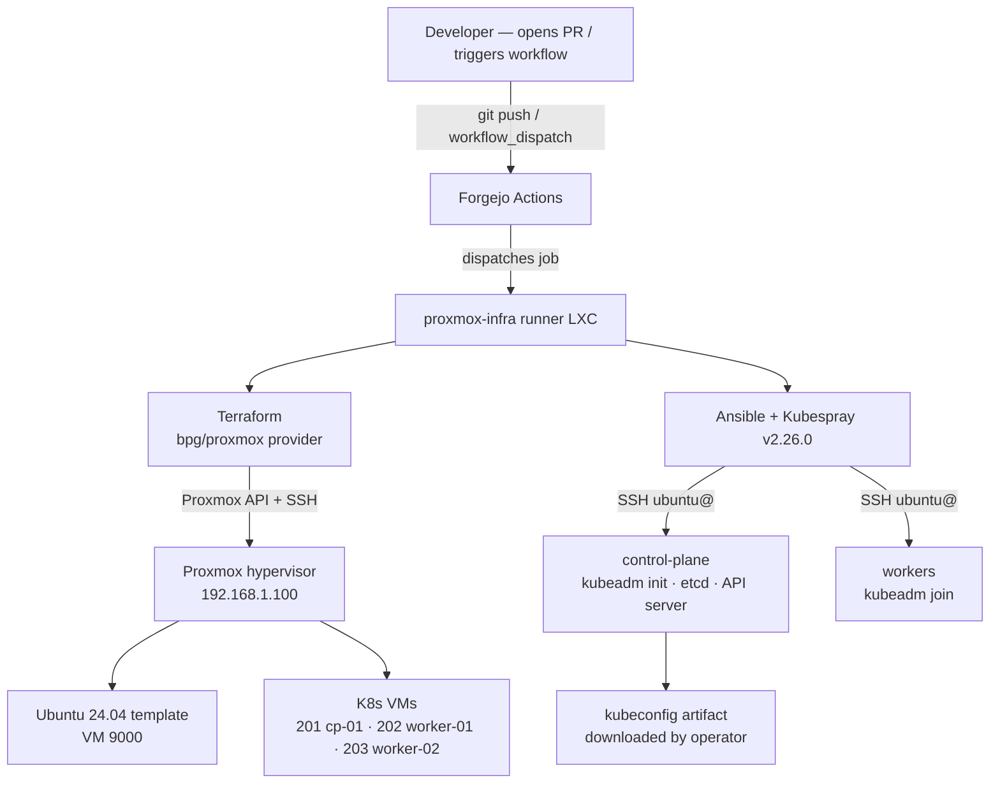
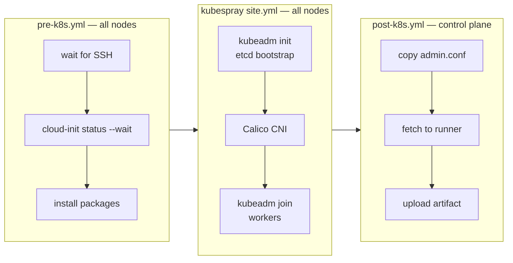

# Chapter 01 — Concepts & Architecture

**Goal:** Build the mental model you need before touching any files.

**You will learn:** What each tool does, why it's in the stack, and how the
pieces connect — from a git push to a running Kubernetes pod.

**Prerequisites:** None. Read this first.

**Where to run commands:** Nowhere yet — this chapter is reading only.

---

A ground-up explanation of every technology in this stack, written for someone
who has Linux experience but hasn't worked with Kubernetes or Proxmox before.
Read this before touching any files.

---

## The big picture

This repo automates one thing: **turning bare hardware into a running
Kubernetes cluster**, without any manual clicking. The pipeline has three layers:



Each layer speaks to the one below it. Forgejo is the conductor; Terraform and
Ansible are the instruments; Proxmox is the stage.

---

## Proxmox

**What it is:** A bare-metal hypervisor. It runs directly on the physical
server and lets you create Virtual Machines (VMs) on top of it. Think of it
as VMware Workstation for servers, with a web UI and an API.

**Why we use it:** We need multiple independent Linux machines for a Kubernetes
cluster (one control plane + two workers). Proxmox lets us create all of them
on a single physical box.

**How we interact with it:** Never by clicking. Terraform talks to the Proxmox
API using an API token (`terraform@pam!ci`) to create, configure, and delete VMs.

**Key Proxmox concepts you'll see in this repo:**

- **VM ID** — every VM on a Proxmox node has a numeric ID. Our template is `9000`;
  cluster VMs are `201`, `202`, `203`. IDs must be unique per node.
- **Storage** — Proxmox uses named storage pools. We use `local-lvm` (LVM thin
  provisioning — fast, space-efficient, good for VM disks).
- **Bridge** — `vmbr0` is the virtual network switch. VMs connect to it just
  like plugging an ethernet cable into a switch. It bridges to the physical NIC.
- **Cloud-init** — a cloud standard for injecting user data (SSH keys, hostname,
  IP config) into a VM on first boot. Our VMs use it to get their static IPs
  and SSH key without us logging in to set them manually.

---

## Terraform

**What it is:** Infrastructure-as-Code (IaC) tool. You describe *what* you want
in `.tf` files (declarative), and Terraform figures out *how* to create it.

**Why we use it:** Without Terraform, someone would click through the Proxmox UI
to create VMs — a manual, error-prone, unrepeatable process. With Terraform, the
same VMs get created identically every time from version-controlled code.

**Core concepts:**

- **Provider** — a plugin that lets Terraform talk to a specific API. We use
  `bpg/proxmox` (a community provider for Proxmox VE). It's declared in
  `terraform/envs/homelab/main.tf`.

- **Resource** — a thing Terraform manages. `proxmox_virtual_environment_vm` is
  a resource representing one VM. Terraform tracks whether it exists, and creates,
  updates, or destroys it to match your `.tf` files.

- **State** — Terraform writes a `terraform.tfstate` file recording what it has
  created. On the next run it compares your `.tf` files against the state to
  compute a diff (the *plan*). Without state, Terraform can't know what already
  exists.

- **State backend** — where the state file lives. We store it in RustFS (an
  S3-compatible object store on TrueNAS) instead of a local file, so it persists
  across CI runner runs and team members can share it safely.

- **Variables** — inputs to Terraform. Sensitive values (tokens, keys) come from
  environment variables (`TF_VAR_*`). Non-sensitive values (IPs, node name) come
  from Forgejo Variables. Nothing sensitive is ever in a `.tf` file.

- **Modules** — reusable blocks of Terraform code. We have two:
  `proxmox-template` (creates the Ubuntu template VM) and `proxmox-vm` (clones
  from it to make cluster VMs). You configure them once, use them three times.

- **Plan vs Apply** — `terraform plan` shows you what *would* change without
  doing it. `terraform apply` actually makes the changes. In CI, plan runs
  automatically on PRs; apply is always manual.

**Our module structure:**

```
terraform/
├── envs/homelab/          ← environment: what to build
│   ├── main.tf            ← calls the modules, configures provider
│   ├── variables.tf       ← declares all input variables
│   ├── outputs.tf         ← exports IP addresses for Ansible to consume
│   └── backend.tf         ← tells Terraform where to store state
└── modules/
    ├── proxmox-template/  ← downloads Ubuntu image, creates template VM
    └── proxmox-vm/        ← clones template, sets cloud-init, static IP
```

---

## Ansible

**What it is:** A configuration management and automation tool. You write
*playbooks* (YAML files) that describe tasks to run on remote machines over SSH.
No agent is needed on the target machines — just SSH access and Python.

**Why we use it:** Once VMs exist (Terraform's job), we need to install and
configure software inside them. Kubernetes installation involves tens of steps
across three machines. Ansible makes all of this reproducible.

**Core concepts:**

- **Inventory** — a file (or directory of files) listing the hosts Ansible
  should target, organized into groups. Ours is generated at runtime from
  Terraform's output JSON, so it always matches the actual VMs.

- **Playbook** — a YAML file containing a list of *plays*. Each play targets a
  group of hosts and runs a list of *tasks*.

- **Task** — one unit of work: copy a file, install a package, run a command,
  set a sysctl value. Tasks are idempotent — running them twice leaves the
  system in the same state.

- **Module** — a named Ansible action (`ansible.builtin.apt`, `ansible.posix.sysctl`,
  etc.). Modules are the verbs; tasks combine a module with its arguments.

- **Become** — Ansible's term for privilege escalation (sudo). Our nodes need
  `become: true` for most tasks because Kubernetes setup requires root. Our
  runner LXC does *not* — hence the `become: false` at play level in `post-k8s.yml`.

- **Group vars** — variables that apply to a group of hosts. `all.yml` sets SSH
  connection params; `kubespray.yml` sets Kubernetes version, CNI, etc.

- **Galaxy** — Ansible's package registry. We pull `community.general`,
  `ansible.posix`, and `kubernetes.core` from it via `requirements.yml`.

**Our playbook flow:**



---

## Kubespray

**What it is:** An Ansible playbook collection from the Kubernetes project that
installs production-grade Kubernetes clusters. It supports many CNI plugins,
container runtimes, and cluster topologies.

**Why we use it instead of `kubeadm` directly:** Kubespray handles all the
edge cases — certificate generation, etcd clustering, CNI wiring, kubeadm
configuration. Writing all of that ourselves would take weeks and be fragile.

**How we pin it:** We don't use a git submodule (fragile on Windows / GitHub
Desktop). Instead, the CI pipeline clones it at runtime:
```bash
git clone --branch v2.26.0 --depth 1 \
  https://github.com/kubernetes-sigs/kubespray.git ansible/kubespray
```
The branch tag pins the version. `v2.26.0` supports Kubernetes `v1.31.x`.

**Key configuration knobs (in `kubespray.yml`):**

| Setting | Value | Why |
|---|---|---|
| `kube_version` | `v1.31.4` | pinned for reproducibility |
| `kube_network_plugin` | `calico` | battle-tested L3 CNI |
| `calico_ipip_mode` | `Always` | required on same L2; avoids ARP issues |
| `container_manager` | `containerd` | standard CRI; Docker shim removed in K8s 1.24 |
| `etcd_deployment_type` | `kubeadm` | co-located with control plane (fine for single CP) |
| `helm_enabled` | `true` | needed for most real workloads |
| `metrics_server_enabled` | `true` | enables `kubectl top nodes` |

---

## Kubernetes itself

If you're new to Kubernetes, here's the minimum context for this repo:

**Control plane node** — the "brain". Runs the API server, scheduler, and
controller manager. `kubectl` talks to it. We have one: `k8s-cp-01`.

**Worker nodes** — where your application containers actually run. We have two:
`k8s-worker-01`, `k8s-worker-02`. The scheduler assigns Pods to workers.

**kubelet** — an agent that runs on every node. It receives instructions from
the control plane and manages containers on its node via the container runtime.

**Container runtime** — what actually runs containers. We use `containerd`.
It's what Docker uses internally; we just skip the Docker daemon.

**CNI (Container Network Interface)** — makes pod-to-pod networking work across
nodes. We use Calico with IPIP encapsulation. Without a CNI, pods on different
nodes can't talk to each other.

**kubeconfig** — a YAML file with the API server address and credentials. It's
what `kubectl` reads. Our `post-k8s.yml` fetches it from the control plane and
patches the server URL so it's reachable from outside the cluster.

---

## Forgejo

**What it is:** A self-hosted Git forge (like GitHub but self-hosted). We run
it on TrueNAS. It provides repository hosting, pull requests, and CI/CD via
*Forgejo Actions* (compatible with GitHub Actions YAML syntax).

**Why self-hosted:** This is a homelab — no internet exposure. Forgejo runs on
the LAN alongside Proxmox.

**Actions vs GitHub Actions:** Nearly identical YAML. The main difference is
that `uses:` references `https://code.forgejo.org/forgejo/...` action URIs
instead of `actions/...`. Secrets and variables work identically.

**The runner:** Actions run on a *runner* — a process that polls Forgejo for
jobs and executes them. Our runner is an LXC container on Proxmox labelled
`proxmox-infra:host`. The `:host` suffix tells Forgejo it uses the host
executor (runs commands directly on the LXC, not inside Docker).

**Secrets vs Variables:**
- **Secrets** — encrypted, never visible in logs. Used for tokens, passwords,
  private keys. Accessed as `${{ secrets.NAME }}`.
- **Variables** — plain text, visible in logs. Used for non-sensitive config like
  IPs, node names, bridge names. Accessed as `${{ vars.NAME }}`.

---

## RustFS (state backend)

**What it is:** An S3-compatible object storage server. We run it on TrueNAS
Scale as a Kubernetes app (yes, K8s-on-TrueNAS hosting the state for our K8s
cluster — it was already there).

**Why S3 for Terraform state:** Terraform's local state only works for one
person on one machine. An S3 backend means the state is durable, accessible
from any CI runner, and supports state locking (only one `apply` runs at a time).

**Why not MinIO:** RustFS is already running. MinIO was explicitly excluded from
this setup's constraints. They are API-compatible — the Terraform S3 backend
config works with either.

**Key backend config quirks for non-AWS S3:**

```hcl
# terraform/envs/homelab/backend.tf
endpoints = { s3 = "http://192.168.1.50:30293" }
region    = "us-east-1"  # required field, ignored by RustFS but must be set
skip_requesting_account_id = true  # AWS-specific, not supported by RustFS
use_path_style             = true  # buckets in path, not subdomain
skip_s3_checksum           = true  # AWS CRC32C, not supported by RustFS
```

Each `true`/`skip` exists because Terraform's S3 backend has AWS-specific
behaviour that S3-compatible servers don't support. Without these flags,
`terraform init` either errors or produces false warnings.

---

## How secrets flow through the system

Understanding the full credential chain prevents confusion when something fails.
Each key is scoped to exactly one layer — a VM compromise cannot reach Proxmox.

```mermaid
flowchart TD
    subgraph secrets["Forgejo Secrets"]
        S1[PROXMOX_SSH_PRIVATE_KEY\nk8s_proxmox private key]
        S2[PROXMOX_VE_API_TOKEN\nterraform@pam!ci=uuid]
        S3[ANSIBLE_SSH_PRIVATE_KEY\nk8s_ansible private key]
        S4[ANSIBLE_SSH_PUBLIC_KEY\nk8s_ansible public key]
        S5[RUSTFS_ACCESS/SECRET_KEY]
    end

    subgraph terraform["Terraform — bpg/proxmox provider"]
        T1[Proxmox REST API\nVM create · resize · start]
        T2[Proxmox host SSH\ndisk import only]
        T3[cloud-init\ninject public key into VM]
        T4[RustFS S3 backend\nterraform.tfstate]
    end

    subgraph ansible["Ansible — SSH ubuntu@"]
        A1[K8s VMs\npre-k8s · kubespray · post-k8s]
    end

    S1 -->|env var — never written to disk| T2
    S2 -->|TF_VAR_proxmox_api_token| T1
    S4 -->|TF_VAR_ansible_ssh_public_key| T3
    T3 -->|authorized_keys at first boot| A1
    S3 -->|written to runner ~/.ssh/k8s_ansible\ndeleted after workflow| A1
    S5 -->|AWS_ACCESS/SECRET_KEY env vars| T4
```

> **Key rule:** `k8s_proxmox` is authorised on the Proxmox host only.
> `k8s_ansible` is authorised on K8s VMs only. Neither key can reach the
> other layer. A compromised VM cannot pivot to Proxmox.

**Blast radius matrix:**

| Compromised credential | Can reach Proxmox API | Can SSH Proxmox host | Can SSH K8s VMs |
|---|---|---|---|
| `PROXMOX_VE_API_TOKEN` | ✅ Yes | ❌ No | ❌ No |
| `PROXMOX_SSH_PRIVATE_KEY` | ❌ No | ✅ Yes (root) | ❌ No |
| `ANSIBLE_SSH_PRIVATE_KEY` | ❌ No | ❌ No | ✅ Yes (ubuntu+sudo) |
| `RUSTFS_ACCESS_KEY/SECRET` | ❌ No | ❌ No | ❌ No |
| K8s VM shell (container escape) | ❌ No | ❌ No | that VM only |

---

## Why things are the way they are

Design decisions that might seem odd without context:

**Why no `terraform.tfvars` in CI?**
`terraform.tfvars` is a local convenience file for running Terraform manually.
In CI, all inputs come from `TF_VAR_*` environment variables populated from
Forgejo Secrets and Variables. Committing `terraform.tfvars` would commit
sensitive values to git history — even accidentally.

**Why runtime Kubespray clone instead of a submodule?**
Git submodules don't work well with GitHub Desktop on Windows (the primary
management machine for this repo). A `git clone` in the workflow step is
simpler, more transparent, and avoids the common `submodule update --init`
footgun.

**Why manual apply trigger?**
Automatic apply on merge means a typo in a `.tf` file could destroy and
recreate VMs without confirmation. In a homelab with real workloads, that's
unacceptable. The plan runs automatically (safe, read-only); the human reviews
the plan and triggers apply explicitly.

**Why `become: false` at play level in `post-k8s.yml`?**
The runner LXC's `forgejo-runner` user has no passwordless sudo. Tasks
delegated to `localhost` (the runner) would fail if `become: true` were
inherited from `ansible.cfg`. Setting `become: false` at the play level
overrides the global default cleanly without touching any config that the
K8s nodes need.

---

## Checkpoint questions

Work through these after reading. If you can answer them without looking, you're
ready for Chapter 03.

1. What is the difference between Terraform and Ansible? When does each run?
2. Why does Terraform need a state file? What goes wrong without one?
3. What is a Forgejo runner, and why does it need to be on the same LAN as Proxmox?
4. What is cloud-init used for in this setup?
5. Why do we use two SSH keypairs (`k8s_proxmox` and `k8s_ansible`) instead of one?
6. What does CNI stand for, and what problem does Calico solve?
7. If the `ANSIBLE_SSH_PRIVATE_KEY` secret were stolen, what could an attacker reach?

**Answers** are in [appendix/adr.md](appendix/adr.md) (for the design rationale)
and [appendix/glossary.md](appendix/glossary.md) (for definitions).

---

*Next: [Chapter 02 — Lab Environment](02-lab-environment.md)*
